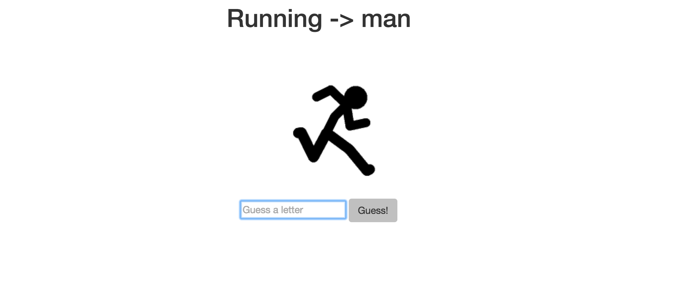

# Running Man

#### A gentler version of hangman. 9/16/2016

#### By _**Aimen Khakwani and HK**_

## Description

Users can guess letters until they uncover a word, or lose after six attempts.

####

## Setup/Installation Requirements

* Clone the repository
* Using the command line, navigate to the project's root directory
* Install dependencies by running $ composer install
* Navigate to the /web directory and start a local server with $ php -S localhost:8000
* Open a browser and go to the address http://localhost:8000 to view the application

# Known Bugs

There are no known bugs at this time.

## Technologies Used

* _PHP_
* _Silex_
* _Twig_
* _Bootstrap_
* _HTML_
* _CSS_

## License

*This website is licensed under the MIT license.*
Copyright (c) 2016  **_Aimen Khakwani and HK_**
